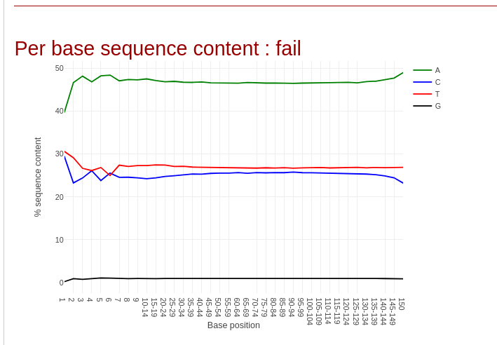
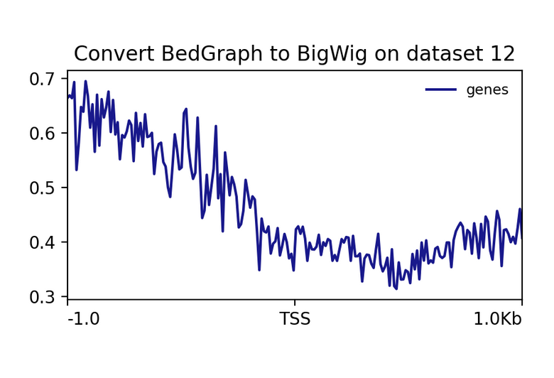
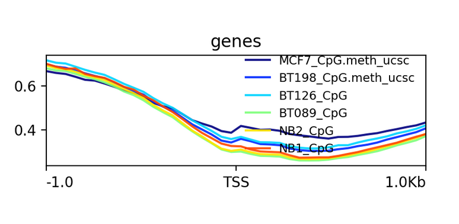
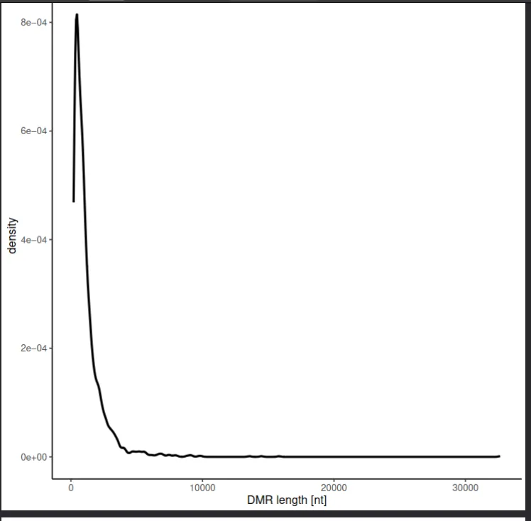

# DNA Methylation Analysis — WGBS Breast Cancer & Epigenetic Aging Clocks

Two independent analyses of DNA methylation data, covering opposite ends of the methylation field: cancer epigenomics and biological aging. The first runs a complete whole-genome bisulfite sequencing pipeline on breast cancer tissue. The second benchmarks eight epigenetic aging clocks against two independent blood methylation datasets to see how they agree, where they fail, and what each one is actually measuring.

---

## What is DNA Methylation?

DNA methylation is a chemical modification where a methyl group is added to the cytosine base at CpG dinucleotide sites across the genome. It is one of the most stable and well-studied epigenetic marks, controlling which genes get expressed and which stay silenced. In healthy cells the pattern is tightly regulated — promoter regions of active genes are kept unmethylated, while gene bodies and repetitive elements carry methylation that stabilises the genome.

Two things make methylation particularly interesting as a measurement target. First, it is quantitative — every CpG in every cell either is or isn't methylated, and bulk sequencing measures the fraction of cells methylated at each position, giving a continuous signal rather than a binary one. Second, it is chemically stable and can be read at single-base resolution using bisulfite conversion, which is the foundation of the WGBS pipeline in Analysis 1.

In cancer, this carefully maintained landscape falls apart in two simultaneous and opposing ways: large genomic regions lose methylation globally while specific gene promoters gain it. In aging, methylation drifts at hundreds of CpG sites in predictable directions that allow age to be estimated from a blood sample alone. Both phenomena are explored here.

---

## Repository Structure

```
dna-methylation-analysis/
│
├── wgbs_breast_cancer/
│       ├── 01_qc_read1_sequence_content.png
│       ├── 02_qc_read2_sequence_content.png
│       ├── 03_methylation_bias_top_strand.png
│       ├── 04_methylation_profile_single_sample.png
│       ├── 05_methylation_profile_all_samples.png
│       ├── 06_dmr_methylation_difference_distribution.png
│       ├── 07_dmr_length_nucleotides.png
│       ├── 08_dmr_length_cpg_count.png
│       ├── 09_dmr_qvalue_vs_difference.png
│       ├── 10_dmr_group1_vs_group2_methylation.png
│       └── 11_dmr_length_nt_vs_cpg.png
│
├── aging_clock/
│   ├── aging_clock_benchmarking.ipynb
│       ├── 01_correlation_matrix_GSE120307.png
│       ├── 02_correlation_matrix_GSE41169.png
│       ├── 03_age_deviation_heatmap_GSE120307.png
│       ├── 04_age_deviation_heatmap_GSE41169.png
│       ├── 05_predicted_vs_chronological_age_GSE120307.png
│       ├── 06_predicted_vs_chronological_age_GSE41169.png
│       ├── 07_mean_absolute_error_comparison.png
│       └── 08_predicted_age_distributions.png
│
└── README.md
```

---

## Analysis 1 — WGBS Breast Cancer Pipeline

**Platform:** Galaxy Europe  
**Dataset:** Lin et al. (2015) — ArrayExpress accession E-MTAB-2014  
**Reference genome:** hg38 (GRCh38), chromosome 6 subset  

### Why WGBS for Cancer?

Normal breast tissue maintains a clear methylation architecture: promoter CpG islands of expressed genes are unmethylated and open for transcription, while the rest of the genome carries stable background methylation that keeps repetitive elements silenced. In invasive ductal carcinoma this architecture is systematically disrupted. Promoter CpG islands that should be unmethylated gain methylation and shut down tumour suppressor genes — without a single nucleotide of the DNA sequence changing. Simultaneously, vast stretches of the genome that should be methylated lose it, destabilising the chromosome and allowing normally silenced genes and repetitive elements to become active.

Whole-genome bisulfite sequencing is the tool that makes both changes visible simultaneously, at every CpG in the genome, at single-base resolution. The chemistry is simple: bisulfite treatment converts unmethylated cytosines to uracil (read as thymine after PCR), while methylated cytosines resist conversion and remain cytosine. Comparing C vs T calls at each CpG position in aligned reads reconstructs the methylation state across the entire genome.

### Samples

| Sample | Tissue | Group |
|--------|--------|-------|
| NB1 | Normal breast | Control |
| NB2 | Normal breast | Control |
| BT089 | Invasive ductal carcinoma | Case |
| BT126 | Invasive ductal carcinoma | Case |
| BT198 | Invasive ductal carcinoma | Case |
| MCF7 | Breast cancer cell line | Case |

### Pipeline

```
Raw paired-end FASTQ (bisulfite-treated)
        │
        ▼  Falco v1.2.4
   Quality control — bisulfite conversion check
        │
        ▼  bwameth v0.2.7
   Bisulfite-aware alignment to hg38
        │
        ▼  MethylDackel v0.5.2
   Per-CpG methylation extraction + positional bias check
        │
        ▼  computeMatrix + plotProfile v3.5.4
   Average methylation profiles around TSS / CpG islands
        │
        ▼  Metilene v0.2.6.1
   Differentially methylated region (DMR) detection
        │
        ▼
   bedGraph files, DMR tables, methylation profiles
```

---

### Output Figures — Full Walkthrough

---

#### Figure 01 — Per-base Sequence Content, Read 1

**What is shown:** Nucleotide frequency at each position across all Read 1 sequences, output by Falco.

**What to look for:** In a normal non-bisulfite library, the four nucleotides (A, T, G, C) run approximately parallel at around 25% each. A bisulfite-treated library should look nothing like this.

**What this figure shows:** Cytosine (C) frequency drops to approximately 0% across every position of Read 1. Thymine (T) rises to approximately 50%. This is not an error — it is the required signature of successful bisulfite conversion. Every unmethylated cytosine in the library has been chemically converted to uracil and amplified as thymine. A high remaining C signal here would indicate failed conversion and would invalidate all downstream methylation calls. The near-total depletion of C confirms the library was properly treated before sequencing.

---

#### Figure 02 — Per-base Sequence Content, Read 2



**What is shown:** Same nucleotide frequency plot for Read 2 (the reverse read of the paired-end library).

**What this figure shows:** The bisulfite conversion signature is confirmed in the reverse strand — C again approaches 0%, T is elevated. This confirms that both strands of the library underwent complete bisulfite treatment. Both reads are validated for downstream analysis.

---

#### Figure 03 — Methylation Bias, Original Top Strand


**What is shown:** Average CpG methylation percentage as a function of read position, generated by MethylDackel's `mbias` function on the original top strand.

**Why this matters:** Some bisulfite library preparation protocols introduce positional artefacts — artificially inflated or deflated methylation calls at the 5′ or 3′ ends of reads. This happens because end-repair enzymes used in library preparation can incorporate unmethylated cytosines at read termini, which then convert and appear as low-methylation regions regardless of the actual biology. If this artefact is present, those positions must be excluded from methylation extraction.

**What this figure shows:** CpG methylation sits stably at 70–75% across all read positions with no upward or downward drift at either terminus. There is no positional artefact in this library. All positions from all reads are therefore retained for methylation extraction — no trimming required. This is the ideal mbias result.

---

#### Figure 04 — Methylation Profile, Single Sample



**What is shown:** Average CpG methylation level in windows centered on CpG islands and their associated transcription start sites (TSS), generated by computeMatrix and plotProfile for one sample.

**What this figure shows:** A characteristic dip in methylation centered exactly on the TSS. This is biologically expected and required for normal gene regulation. Active gene promoters in normal cells are maintained in an unmethylated state — methylation at the promoter would recruit repressor complexes, compact chromatin, and silence the gene. The flanking CpG island shores carry intermediate methylation levels, consistent with the known methylation gradient around CpG islands. This single-sample profile establishes the normal baseline before the six-sample comparison.

---

#### Figure 05 — Methylation Profile, All Six Samples



**What is shown:** plotProfile output overlaying all six samples simultaneously — two normal controls (NB1, NB2) and four cancer samples (BT089, BT126, BT198, MCF7) — around the same CpG island / TSS reference.

**What this figure shows:** This is where the cancer biology becomes visible. Normal breast tissue (NB1, NB2) shows a deep, clean TSS dip — promoter CpG islands are unmethylated as expected. All four cancer samples show a markedly attenuated dip: methylation levels at the TSS are substantially higher than in normal tissue, indicating that cancer cells have gained methylation at promoter CpG islands that should remain open.

This is the canonical epigenomic hallmark of promoter CpG island hypermethylation in cancer — gene silencing through methylation rather than mutation. The genes silenced at these loci include tumour suppressors whose loss of expression drives oncogenesis. Lin et al. (2015) identified widespread examples of this in invasive ductal carcinoma, and this figure directly recapitulates that finding at a population level across six samples.

---

#### Figure 06 — DMR Methylation Difference Distribution


**What is shown:** Frequency histogram of mean methylation differences (cancer BT198 minus normal NB1/NB2) across all differentially methylated regions detected by Metilene.

**What this figure shows:** The distribution is strongly left-skewed. Most DMRs have negative methylation differences — meaning the cancer sample is hypomethylated relative to normal tissue at these regions. The right-sided tail represents the smaller subset of regions where cancer is hypermethylated relative to normal.

This asymmetry is the most important single result of the DMR analysis. Global hypomethylation is the dominant epigenomic change in invasive ductal carcinoma, not hypermethylation. The promoter hypermethylation that silences tumour suppressors — visible in Figure 05 — occurs at specific loci but is numerically outnumbered by the much broader genomic hypomethylation occurring across partially methylated domains and repetitive elements.

---

#### Figure 07 — DMR Length Distribution (Nucleotides)



**What is shown:** Frequency histogram of DMR lengths measured in base pairs.

**What this figure shows:** Most DMRs fall in the kilobase range. This is consistent with the scale of hypomethylated region (HMR) expansions and contractions reported in Lin et al. Shorter DMRs represent discrete promoter or enhancer methylation changes; the longer kilobase-scale DMRs are consistent with partially methylated domain erosion spanning large genomic stretches in tumour cells.

---

#### Figure 08 — DMR Length Distribution (CpG Count)


**What is shown:** Frequency histogram of DMR lengths measured by number of CpG sites spanned.

**What this figure shows:** The CpG count distribution closely tracks the nucleotide length distribution, as expected for regions with approximately uniform CpG density. The minimum CpG count enforced by Metilene's segmentation algorithm ensures that every reported DMR represents a genuine multi-CpG methylation change — not a noise artefact at a single site.

---

#### Figure 09 — Mean Methylation Difference vs Q-value


**What is shown:** Scatter plot of mean methylation difference (x-axis) against −log₁₀ of the Benjamini–Hochberg adjusted q-value (y-axis) for all detected DMRs — effectively a methylation volcano plot.

**What this figure shows:** The most statistically significant DMRs reach q-values below 1×10⁻¹⁰⁰. These extreme values reflect regions where large numbers of CpG sites are uniformly hypomethylated across all cancer replicates, generating overwhelming statistical evidence. The fact that the highest-significance points cluster predominantly on the left (negative differences) again reinforces that hypomethylation in cancer produces the most consistent, statistically robust signal. The smaller cluster of significantly hypermethylated DMRs on the right represents the focal promoter events.

---

#### Figure 10 — Group 1 vs Group 2 Mean Methylation


**What is shown:** Per-DMR scatter plot with mean methylation of normal breast tissue (Group 1) on the x-axis and mean methylation of invasive ductal carcinoma (Group 2) on the y-axis. The diagonal represents no change between groups.

**What this figure shows:** Points below the diagonal are DMRs hypomethylated in cancer. Points above are DMRs hypermethylated in cancer. The majority of points fall below the diagonal. A particularly striking cluster sits along the x-axis at high normal-methylation values (0.7–1.0) that drop near zero in cancer — regions that are fully methylated in normal breast tissue and have completely lost their methylation in tumour cells. This is the signature of PMD erosion: large genomic blocks that carry dense methylation in normal tissue collapse to near-zero methylation in cancer, destabilising genome structure.

---

#### Figure 11 — DMR Length in Nucleotides vs CpG Count


**What is shown:** Bivariate scatter of each DMR's nucleotide length against its CpG count.

**What this figure shows:** A strong positive linear relationship — longer regions contain more CpGs — as expected. Deviations from the trend carry structural information. DMRs sitting above the trend line (more CpGs than their length would predict) overlap CpG islands, which are CpG-dense by definition. DMRs falling below the trend line occur in CpG-sparse genomic regions such as gene bodies or intergenic space. The scatter plot provides a structural map of where in the genome the detected DMRs are located.

---

### WGBS Summary Table

| Step | Tool | Key Result | Biological Meaning |
|------|------|------------|--------------------|
| Quality control | Falco v1.2.4 | C → ~0%, T → ~50% per base in both reads | Complete bisulfite conversion confirmed |
| Alignment | bwameth v0.2.7 | Reads mapped to hg38 | Bisulfite-aware aligner handles C→T mismatches correctly |
| Bias check | MethylDackel v0.5.2 | Flat 70–75% methylation across all read positions | No positional artefact, full data retained |
| Methylation profiling | computeMatrix + plotProfile v3.5.4 | TSS dip attenuated in all cancer samples | Aberrant promoter CpG island hypermethylation in cancer |
| DMR detection | Metilene v0.2.6.1 | Left-skewed difference distribution, q < 1×10⁻¹⁰⁰ for top DMRs | Global hypomethylation dominant, focal hypermethylation at promoters |

---

## Analysis 2 — Epigenetic Aging Clock Benchmarking

**Platform:** Google Colab  
**Library:** Biolearn (Python)  
**Notebook:** `02_epic_array_aging_clocks/aging_clock_benchmarking.ipynb`

### What Are Epigenetic Clocks?

Certain CpG sites in the genome change their methylation level with age in a highly consistent way across individuals — some sites gain methylation steadily through life, others lose it. By training penalised regression models on methylation data from people of known age, it is possible to build predictors — epigenetic clocks — that estimate biological age from a blood sample alone, typically with mean errors of 3–5 years.

The interesting part is not the age estimate itself but the divergence from chronological age: epigenetic age acceleration. When a clock says someone is biologically 10 years older than their birth certificate suggests, this excess aging signal has been consistently associated with higher mortality risk, cardiovascular disease, and cancer. The clocks are measuring something about biological aging that shows up in methylation before clinical disease does.

Different clocks were designed with different objectives. First-generation clocks were trained to predict chronological age as accurately as possible. Second-generation clocks were trained on clinical biomarkers and mortality outcomes, deliberately moving away from pure chronological age prediction toward health-relevant aging signals. DunedinPACE is a fundamentally different kind of model — trained on longitudinal measurements of how fast biological systems are deteriorating rather than on a static age point.

### Datasets

| Dataset | Accession | Samples | Description |
|---------|-----------|---------|-------------|
| Dataset 1 | GSE120307 | 34 | Whole blood, Illumina EPIC 850K |
| Dataset 2 | GSE41169 | 95 | Whole blood, Illumina EPIC 850K |

### Clocks Benchmarked

| Clock | Year | CpGs | Trained On | Generation |
|-------|------|------|------------|------------|
| Horvathv1 | 2013 | 353 | Chronological age, pan-tissue | 1st |
| Hannum | 2013 | 71 | Chronological age, blood | 1st |
| Lin | 2016 | 99 | Chronological age, blood | 1st |
| PhenoAge | 2018 | 513 | Composite clinical biomarkers | 2nd |
| GrimAge | 2019 | ~1000 | Mortality risk | 2nd |
| DunedinPACE | 2022 | 173 | Longitudinal physiological decline rate | Pace |
| Zhang_10 | 2019 | 10 | Chronological age (minimal CpG set) | Minimal |
| HRSInChPhenoAge | 2022 | 513 | Phenotypic age, Health and Retirement Study | 2nd |

**Note on DunedinPACE:** Every other clock outputs a predicted age in years. DunedinPACE outputs a dimensionless pace-of-aging score where the population mean is 1.0. Near-zero or negative correlations between DunedinPACE and the other clocks are biologically expected — not an indication that anything went wrong.

---

### Output Figures — Full Walkthrough

---

#### Figure 01 — Clock Correlation Matrix, GSE120307


**What is shown:** Pearson correlation matrix of predicted values from all 8 clocks across 34 samples (GSE120307). Each cell shows how strongly two clocks agree in their sample-to-sample ranking. Warmer colours indicate higher correlation.

**What this figure shows:** Three distinct groupings emerge. First-generation chronological clocks (Horvathv1, Hannum, Lin) form a tight cluster with pairwise correlations above r = 0.90 — trained on the same objective and sharing substantial biological signal despite using different CpG sets. Second-generation clocks (PhenoAge, GrimAge, HRSInChPhenoAge) correlate moderately with the first-generation group (r ≈ 0.70–0.85) but diverge from each other, reflecting differences in their training phenotypes. DunedinPACE sits alone at near-zero or negative correlations with everything else — exactly as expected for a pace-of-aging instrument measuring a conceptually different quantity.

---

#### Figure 02 — Clock Correlation Matrix, GSE41169


**What is shown:** The same correlation matrix for 95 samples (GSE41169).

**What this figure shows:** The grouping structure replicates almost exactly in the independent dataset. Overall correlation values are modestly lower, consistent with the larger and more heterogeneous cohort. No pattern from GSE120307 disappears here, and no unexpected new pattern appears. Reproducibility of correlation structure across independent datasets confirms that these groupings reflect genuine differences in clock design, not sampling noise.

---

#### Figure 03 — Age Deviation Heatmap, GSE120307


**What is shown:** Heatmap where each row is a clock, each column is a sample, and colour represents epigenetic age deviation (predicted age minus chronological age). Red = clock predicts older than actual age. Blue = clock predicts younger.

**What this figure shows:** Most first and second-generation clocks keep predictions within roughly ±10 years for the majority of samples. Several samples display consistent red or consistent blue across multiple clocks simultaneously. When Horvathv1, Hannum, Lin, and PhenoAge all agree that the same person looks biologically older — despite being trained on different CpG sets and phenotypes — this concordance provides much stronger evidence of genuine biological age differences than any single clock alone.

Zhang_10 shows the most extreme deviations from the others, reflecting the instability of compressing a clock to only 10 CpG sites. DunedinPACE shows systematically large deviations from chronological age as expected given its different output scale.

---

#### Figure 04 — Age Deviation Heatmap, GSE41169


**What is shown:** Same age deviation heatmap for GSE41169 (95 samples).

**What this figure shows:** With almost three times as many samples, within-sample multi-clock concordance becomes more clearly visible. Columns with consistent warm or cool tones across several clocks are apparent — individuals who appear consistently accelerated or decelerated across independent models. This pattern, replicated in a second cohort, supports the view that epigenetic clocks are capturing real inter-individual variation in biological aging and not just modelling noise. The broader deviation range compared to GSE120307 reflects the wider chronological age span of this dataset.

---

#### Figure 05 — Predicted vs Chronological Age, GSE120307


**What is shown:** One scatter plot per clock, predicted age on the y-axis, chronological age on the x-axis. The red dashed diagonal is perfect prediction.

**What this figure shows:** Clocks whose points track tightly along the diagonal are accurately predicting chronological age. Horvathv1 and Hannum perform best in this dataset. PhenoAge and GrimAge show slight systematic offsets above the diagonal, expected since they were trained on health-related outcomes rather than pure chronological age.

Zhang_10 is immediately distinguishable: the scatter is broad, many points deviate substantially from the diagonal, and there is no clear linear tracking. Ten CpGs is not enough signal to robustly predict age across datasets.

DunedinPACE forms a horizontal band — its predictions are not supposed to track chronological age, so this is the correct outcome.

---

#### Figure 06 — Predicted vs Chronological Age, GSE41169


**What is shown:** The same per-clock scatter plots for GSE41169 (95 samples).

**What this figure shows:** The broader age range makes clock performance differences starker. Horvathv1 maintains strong linear tracking from the youngest to the oldest samples — a genuine pan-tissue predictor holding up across a wide age span. The failure of Zhang_10 is more visible here: predictions scatter across decades regardless of true age, with some individuals predicted near zero and others far beyond their actual age. The 10-CpG model has overfit its training data and cannot generalise.

Second-generation clocks show systematic upward offsets that increase at older ages — consistently calling the biology of older individuals even older, reflecting sensitivity to health-related aging signals that accumulate above the chronological baseline.

---

#### Figure 07 — Mean Absolute Error Comparison


**What is shown:** Bar chart of Mean Absolute Error (MAE) in years for each clock across both datasets. Lower MAE = more accurate chronological age prediction.

**What this figure shows:** Horvathv1 achieves the lowest MAE at approximately 4 years on both datasets. Hannum and Lin follow at approximately 5–7 years.

PhenoAge and GrimAge show higher MAE of approximately 8–12 years. This is not a failure — these clocks were not optimised to minimise chronological age error. Higher chronological MAE is the expected cost of training on clinical biomarkers and mortality outcomes.

Zhang_10 achieves by far the highest MAE — approximately 38 years on GSE120307. Ten CpGs cannot represent enough of the methylation aging signal to produce reliable predictions, and the model collapses in datasets it was not trained on. This illustrates the hard lower bound on CpG count needed for a functional aging clock.

---

#### Figure 08 — Predicted Age Distributions


**What is shown:** Box plots of predicted age distributions per clock for both datasets.

**What this figure shows:** Well-calibrated clocks produce predicted age distributions centred near the mean chronological age of the cohort. First-generation and most second-generation clocks do this. Zhang_10 on GSE120307 is a clear outlier with median predicted age near zero — the model has failed completely on this dataset. DunedinPACE shows a compressed distribution clustered near its expected mean of 1.0, confirming it is operating on its intended dimensionless scale.

---

### Aging Clock Summary

| Metric | Best | Worst | Key Finding |
|--------|------|-------|-------------|
| Chronological MAE | Horvathv1 (~4 yr) | Zhang_10 (~38 yr) | CpG count determines prediction robustness |
| Inter-clock agreement | Horvathv1, Hannum, Lin (r > 0.90) | DunedinPACE | DunedinPACE is conceptually orthogonal by design |
| Prediction calibration | Hannum, Lin | Zhang_10 | Below a minimum CpG count, clocks collapse |
| Cross-dataset consistency | All 1st and 2nd generation | — | Results replicate in both datasets |

---

## How to Reproduce

### Analysis 1 — Galaxy Europe

1. Create a free account on Galaxy Europe
2. Import the Lin et al. dataset from ArrayExpress accession E-MTAB-2014
3. Run each tool in pipeline order using the versions listed below

### Analysis 2 — Google Colab

1. Open `aging_clock_benchmarking.ipynb` in Google Colab
2. Install dependencies:
   ```bash
   pip install biolearn pandas numpy matplotlib seaborn
   ```
3. Run all cells — datasets are fetched automatically from NCBI GEO

---

## Dependencies

### Analysis 1 — Galaxy Europe

| Tool | Version | Purpose |
|------|---------|---------|
| Falco | 1.2.4 | Read quality control and bisulfite conversion verification |
| bwameth | 0.2.7 | Bisulfite-aware alignment to hg38 |
| MethylDackel | 0.5.2 | Per-CpG methylation extraction and bias assessment |
| computeMatrix | 3.5.4 | Signal matrix construction around genomic features |
| plotProfile | 3.5.4 | Methylation profile visualisation |
| Metilene | 0.2.6.1 | Differentially methylated region detection |

### Analysis 2 — Python

```bash
pip install biolearn pandas numpy matplotlib seaborn
```

| Package | Purpose |
|---------|---------|
| biolearn | Epigenetic clock models and GEO data access |
| pandas | Data manipulation |
| numpy | Numerical operations |
| matplotlib | Figure generation |
| seaborn | Heatmaps and correlation matrices |

---

## References

- Lin, I.-H. et al. (2015). Hierarchical Clustering of Breast Cancer Methylomes Revealed Differentially Methylated and Expressed Breast Cancer Genes. *PLOS ONE*, 10(2), e0118453.
- Ying, K. et al. (2023). Biolearn, an open-source library for biomarkers of aging. *bioRxiv*.
- Horvath, S. (2013). DNA methylation age of human tissues and cell types. *Genome Biology*, 14, R115.
- Hannum, G. et al. (2013). Genome-wide methylation profiles reveal quantitative views of human aging rates. *Molecular Cell*, 49(2), 359–367.
- Levine, M.E. et al. (2018). An epigenetic biomarker of aging for lifespan and healthspan. *Aging*, 10(4), 573–591.
- Lu, A.T. et al. (2019). DNA methylation GrimAge strongly predicts lifespan and healthspan. *Aging*, 11(2), 303–327.
- Belsky, D.W. et al. (2022). DunedinPACE, a DNA methylation biomarker of the pace of aging. *eLife*, 11, e73420.
- Wolff, J., Ryan, D., Moosmann, V. (2017). DNA Methylation data analysis. *Galaxy Training Materials*.
